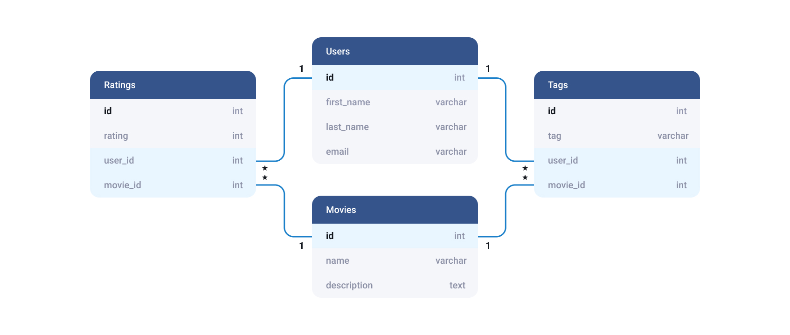

# Data wrangling

```{r, include=FALSE}
knitr::opts_chunk$set(warning = FALSE, message = FALSE) 

```

Data manipulation is surprisingly easy with R. You only need the `dplyr` library included in the `tidyverse` package and know a few words.

## Data Set

This section will work with the Iris data set inherited as default R.  Iris was introduced by Ronald Fisher in his 1936 paper __The use of multiple measurements in taxonomic problems__, contains **three plant species** (setosa, virginica, versicolor) and **four features** measured for each sample.


```{r intro, echo = TRUE}

# The datasets package needs to be loaded to access our data 
# For a full list of these datasets, type library(help = "datasets")
library(datasets)
data(iris)
```

```{r intro_d, echo = FALSE}

library(kableExtra)

head(iris) %>% 
  kbl() %>%
  kable_paper("hover", full_width = F)
  
```


## Dplyr's Wonder

`dplyr` package allows **easy manipulation** through **"verbs"** with a novel pipeline feature. The pipelines shine when you need to arrange many features, which is usually the case.

- `dplyr` verbs are the name of the functions to arrange the data; these include filter, mutate, arrange, group_by and more.

- **The pipeline** `%>%`  means _take the name of the previous object and put it in the first argument of the next function_. The pipelines shin
```{r , eval = FALSE}

library(dplyr)

# 1. Filter without dplyr
example <- filter(iris, Sepal.Width == 3.5)

# 2. Filter with dplyr
example <- iris %>% 
           filter( Sepal.Width == 3.5)

```

Here we will cover 3 basic verbs you might need in your journey; you can consult the [most useful manipulation tips](https://www.maximaformacion.es/blog-ciencia-datos/top-10-manipulacion-de-datos-con-dplyr/) here.


#### 1. Add or change variables {-}

```{r mutate, echo = TRUE}

library(dplyr)

# 1. The mutate verb

example <- iris %>% 
           # A. You can add a complete new variable
           mutate( new_var = 3.3+6/5) %>% 
  
           # B. You can change current variables
           mutate(  Sepal.Width = new_var + Sepal.Width)

```

```{r mut_ex, echo = FALSE}

head(example) %>% 
  kbl() %>%
  kable_paper("hover", full_width = F) %>%
  column_spec(2, background = "#d8d9fb") %>% 
  column_spec(6, background = "#d8d9fb")
  
```


#### 2. Filter the data set {-}

```{r filter, echo = TRUE}

# 2. The filter verb

example <- iris %>% 
           # A. You can filter with specific logical criteria
           filter( Sepal.Length > 5) %>% 
  
           # B. You can add multiple conditions
           filter( Sepal.Length > 5, Sepal.Width < 3)

```

```{r filt_ex, echo = FALSE}

head(example) %>% 
  kbl() %>%
  kable_paper("hover", full_width = F)%>%
  column_spec(1, background = "#d8d9fb") %>% 
  column_spec(2, background = "#d8d9fb")
  
```


#### 3. Select variables of interest{-}

```{r select, echo = TRUE}

# 3. The select verb

example <- iris %>% 
           # A. You can select existing variables
           select( Sepal.Length, Sepal.Width, Species) %>% 
  
           # B. You can also remove just one
           select( -Species)

```

```{r select_ex, echo = FALSE}

head(example) %>% 
  kbl() %>%
  kable_paper("hover", full_width = F)
  
```


# Joining Data 

In your thesis journey, you might need to use **diverse datasets**, most of which are **relational databases**. Relational databases are datasets that can be **linked to another** through a **common key**; the key is usually a unique identifier such as IDs or your own _Clave Única_.

***
```{r , echo = FALSE, fig.cap = "Source [Heavy.AI](https://www.heavy.ai/technical-glossary/relational-database)", out.width = '100%'}

```
***


We leave the **data joining and relational data bases criteria** to the experts through this [comprehensive resource](https://www.garrickadenbuie.com/project/tidyexplain/).


# Plotting with ggplot2

