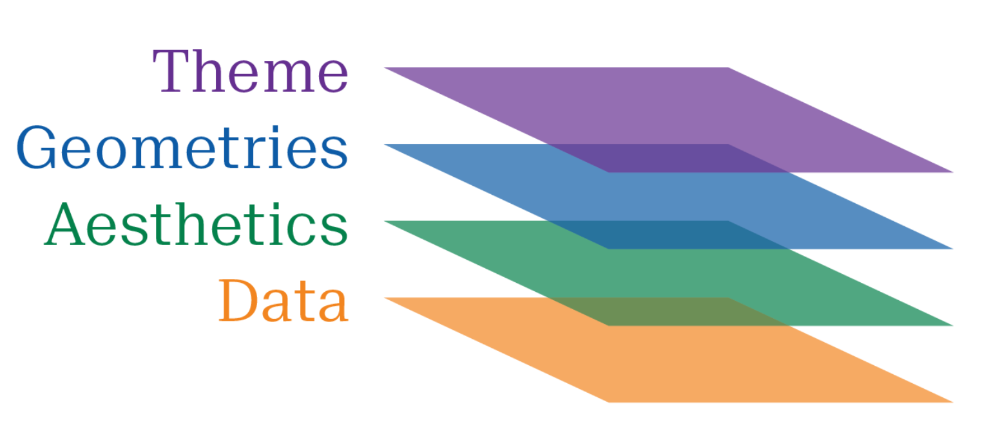

# Joining Data 

In your thesis journey, you might need to use **diverse datasets**, most of which are **relational databases**. Relational databases are datasets that can be **linked to another** through a **common key**; the key is usually a unique identifier such as IDs or your own _Clave Única_.

***
```{r , echo = FALSE, fig.cap = "Source [Heavy.AI](https://www.heavy.ai/technical-glossary/relational-database)", out.width = '100%'}
knitr::include_graphics("./images/relation.jpg")
```
***

You can perform multiple forms of joining data with the `dplyr` package in R. All joins have a similar structure:

```{r , eval = FALSE}

# Join Verb Structure (not code)

data <- data_to_join %>% 
        name_of_join( by = "key_name")

```


## Join verbs

We leave the **data joining and relational data bases criteria** to the experts through this [comprehensive resource](https://www.garrickadenbuie.com/project/tidyexplain/). We will only cover the most common type of join, the left join.


### Left Join {-}

The left join **prioritizes** the **first table** you present; it **returns all rows** in the **left table** and **matching rows** in the **right table**. 

***
```{r , echo = FALSE, fig.cap = "Source [TidyExplain](https://www.garrickadenbuie.com/project/tidyexplain/)", out.width = '75%', fig.align = 'center',}
knitr::include_graphics("./images/left-join.gif")
```
***

If there **is no match** for any of the rows in the left table, **all** the results of the **first table** are still **displayed**, and **NA** is used if **no matching rows** are found in the **right table.** Here's the syntax:


```{r , eval = FALSE}

# Left Join

data <- data_2 %>% 
        left_join( by = "key")

```

# Plotting with R


## The magic of ggplot2

You will probably **present exciting results** with the help of **figures** and plots. The `ggplot2` package allows us to **design** beautiful **graphs** with relatively **low effort** in R.  ggplot2 is designed to build up graphs in 4 steps:

***
```{r , echo = FALSE, fig.cap = "Source DataCamp", out.width = '75%'}

```
***

#### 1. Data {-}

The first step is to provide a data set from which the data will be taken.

```{r , echo = TRUE}
library(tidyverse) 

# 1. Let's generate some data

  x <- 1:30
  y <- rnorm(30) # random numbers from a normal distribution
  label <- x < 15 # True / False boolean vector
  data <- tibble(x,y, label) # data frame (tibble) object
```

#### 2. Aesthetics  {-}

The second step is to specify which data set elements will be mapped to an excellent plot.
```{r , echo = TRUE, out.width= '50%'}

# 2. Specify Elements

  graph <- ggplot(data, # Specify the data set
                   aes(x,y, color = label)) # Specify the elements to map

graph # We expect a blank canvas
```

#### 3. Geometrics {-}

Now that we have specified where the data is coming from and which elements we will use, we need to tell ggplot how we want to visualize the data, i.e., the plotting (geom in `ggplot2`).

```{r , echo = TRUE, out.width= '50%'}

# 3. Specifiy how to plot the data

  graph <- ggplot(data, # Specify the data set
                   aes(x,y, color = label)) + # Specify the elements to map
          geom_point() + # Scatter Plot
          geom_line()   # Line Plot

graph # We now see the points!
```

#### 4. Themes {-}

Finally, we can tell ggplot how we want the look and feel of our graph. Do we want a bold font or large font? You can change every aspect of the graph with the `theme()` function.

```{r , echo = TRUE, out.width= '50%'}

# 4. Personalize your graph!

  graph <- ggplot(data, # Specify the data set
                   aes(x,y, color = label)) + # Specify the elements to map
          geom_point() + # Scatter Plot
          geom_line() +  # Line Plot
          theme(plot.title = element_text(face = "bold", colour = "Black", size = 12)) # Add theme

# Print graph
graph 
```

`ggplot2` has the novelty of identifying the graphs as objects, which means that we can store graphs in variables and lists. Further, we can add more elements to a stored value with the `+`operator.

```{r , echo = TRUE, out.width= '50%'}

# In the last example we forgot to add labels

graph + labs(y = "y", 
       x = "x", 
       title = "Figure 1: Plotting with style", 
       subtitle = "Jaakko's Online Resources",
       colour = NULL, 
       caption = " Source: god")
```


## Ggthemes

Even with full customization, trying different styles to best suit your graph could be exhausting. That's why ggplot2 and other friendly people online have developed pre-defined themes for you to use with one line of code!

- [Ggplot themes](https://ggplot2.tidyverse.org/reference/ggtheme.html)

- [BBC Style](https://github.com/bbc/bbplot/)

- [Ggthemes (expansion) ](https://yutannihilation.github.io/allYourFigureAreBelongToUs/ggthemes/)

- [GGtech](https://github.com/ricardo-bion/ggtech)


```{r , echo = FALSE, out.width= '50%'}

# In the last example we forgot to add labels

graph <- graph + labs(y = "y", 
       x = "x", 
       title = "Figure 1: Plotting with style", 
       subtitle = "Jaakko's Online Resources",
       colour = NULL, 
       caption = " Source: god")
```

```{r , echo = TRUE, out.width= '50%'}


# Let's try The Economist style!
library(ggthemes)

graph + theme_economist()
```

```{r , eval = FALSE, include = FALSE, out.width= '50%'}

library(remotes)
remotes::install_version("Rttf2pt1", version = "1.3.8")

library(extrafont)

font_import(prompt = TRUE)
fonts()


```


## Export your graph


Finally, you would like to export your graph so you can use it in diverse document formats. Here's [how to save a ggplot](https://www.datanovia.com/en/blog/how-to-save-a-ggplot/) in various formats from pdf to png.  We will only cover the most used one, the png type.

```{r , eval = FALSE, out.width= '50%'}

dir.create(dirname("./plot_jaakko.png"), showWarnings = FALSE)
  
  # 1. Open png file
  png(filename = "./plot_jaakko.png",
      width = 1300, 
      height = 1200,  # We can specify resolution and quality
      units = "px", 
      res = 300, 
      pointsize = 11)
  
  # 2. Create the plot
  graph + theme_economist()
  
  # 3. Close the file
  dev.off()
```

# Fancy Tables

If you are working with data, you would like to present tables comprehensibly. The R package suited for this task is `kable` and `kableExtra`.

## Guides for styling

`kable` and `kableExtra` let us display fancy tables in latex or html formats. We can export those tables as png or .tex files to have reproducible examples:

- [HTML Kable Guide](https://haozhu233.github.io/kableExtra/awesome_table_in_html.html#From_other_packages)
- [PDF/latex Kable Guide](https://cran.r-project.org/web/packages/kableExtra/vignettes/awesome_table_in_pdf.pdf)

## Latex

`knitr::kable()` returns a character vector, which you can write to a file, e.g.,

```{r , eval = FALSE, out.width= '50%'}
table <- knitr::kable(data, format = 'latex')
writeLines(table, 'table.tex')
```


## For Word 

Alternatively, you can save your tables as png files.

```{r , eval = FALSE, out.width= '50%'}
# If you want to save the image locally, provide a name 
webshot::install_phantomjs()

# 1. Generate Table
kbl(data, booktabs = T) %>% 
  # 2. Specify style
  column_spec(1, bold = T) %>% 
  # 3. Save and export
  save_kable("my_latex_table.png")
```

